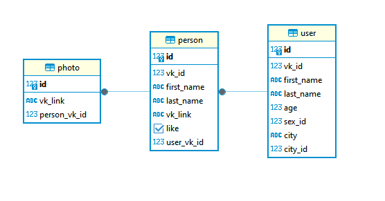

# VKinder бот для знакомств в социальной сети ВКонтакте
Бот использует информацию о пользователе, который открывает с ним чат, для поиска подходящих для знакомства людей Вконтакте. Основные критерии отбора:
- Пол
- Возраст
- Город
- Семейное положение

Предложенных ботом пользователей можно добавить в список избранных.
## Начало работы
Установить зависимости -> python3 -m pip install -r requirements.txt
### Настройки VK
1. Создать группу VK и получить токен для запросов от группы, как показано на [скриншоте](pics/group_settings_1.png)
2. Включить возможность писать сообщения в группу. Управление -> Сообщения -> Сообщения сообщества: включить.
3. Настройки для бота -> Возможности бота: Включены
4. Настройки -> Работа с API -> Long Poll API -> Включить. Типа событий -> Входящие и исходящие сообщения.
5. Получить access токен пользователя -> [https://vkhost.github.io/](https://vkhost.github.io/)
6. Ввести токен бота, id группы и токен пользователя в файл config.ini в соответствующие поля.
### Настройки БД
1. Необходимо наличие базы данных [PostgreSQL](https://www.postgresql.org/download/)
2. Ввести в файле config.ini имя пользователя, пароль и название базы данных.
3. Необходимые таблицы и отношения создаются при первом запуске бота.

Схема базы данных

   

## Взаимодействие с ботом
1. Бот запускается командой "Привет" в чат с группой.
2. Кнопка "Начать поиск" запускает поиск подходящих пользователей. Выдается имя, фамилия кандидата, ссылка на профиль и 3 наиболее популярные (на основе количества лайков) фотографии.
3. Доступна кнопка "Добавить в избранное". К списку избранного можно перейти из главного меню.
4. По кнопке "Следующий" осуществляется переход к следующему пользователю.
5. Кнопка "Главное меню" переводит к главному меню.
6.  Кнопка "Мой список" в главном меню показывает весь список избранных пользователей.
7.  Кнопка "Пока" завершает работу с ботом. Список избранных пользователей при этом сохраняется.
8.  Чтобы возобновить работу с ботом, достаточно отправить в чат команду "Начать".